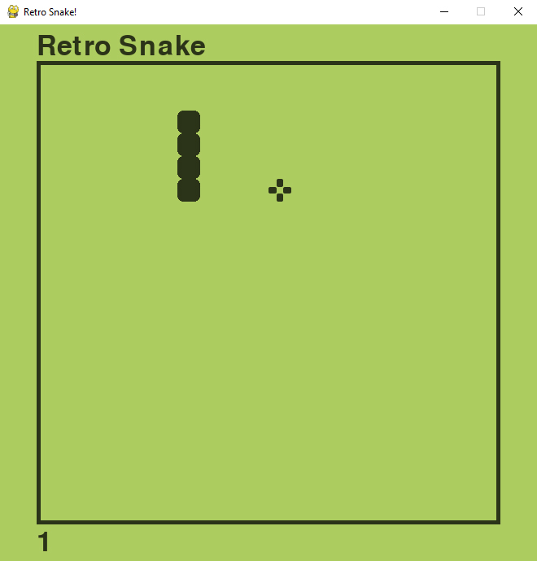

# Python Retro Snake Game with Pygame

In this tutorial I am going to show you how to make Snake, a simple but very addictive game. It is a very simple game by today's standards but it was a massive hit in its day. We are going to build this game using Python and the Pygame module.

Although Snake is a very simple game, it covers a lot of the aspects of computer game programming, like movement, control, collision detection, scoring and so on. If you learn how to program Snake you will be able to program a lot of other games as well.

# Video Tutorial

  

🎥 <a href="https://youtu.be/1zVlRXd8f7g">Video Tutorial on YouTube</a>

 
 

| 📺 <a href="https://www.youtube.com/channel/UC3ivOTE5EgpmF2DHLBmWIWg">My YouTube Channel</a>
| 🌍 <a href="http://www.educ8s.tv">My Website</a> |  

